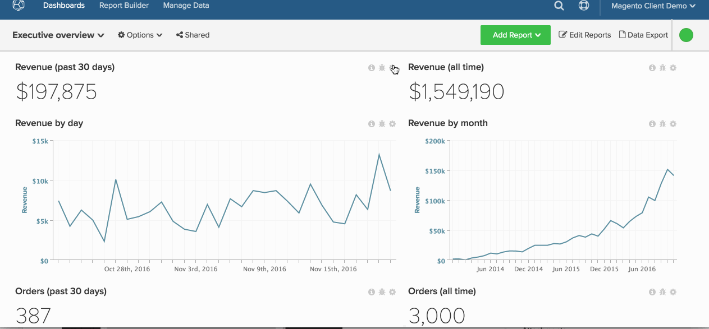

# Export Raw Data

Using raw data exports, you can export records from your [!DNL Commerce Intelligence] Data Warehouse to get a closer look at what is powering your dashboard. Also, raw data exports can help you [pinpoint data discrepancies](https://experienceleague.adobe.com/docs/commerce-knowledge-base/kb/troubleshooting/miscellaneous/using-data-exports-to-pinpoint-discrepancies.html?lang=en).

Raw data exports provide access to additional columns and dimensions generated through de-normalization and pre-aggregation of relevant metrics. For example, `User's first order date` is a dimension that you can export for each user in [!DNL Commerce Intelligence], while it may not be available in your database.

This tutorial covers the following:

* [Selecting Data to Export](#select)
* [Downloading the Export (`.csv` file)](#download)
* [Accessing Historical Exports](#historical)

## Step 1: Selecting Data to Export {#select}

There are two ways that you can export raw data in [!DNL Commerce Intelligence]: at the chart level or at the table level.

### Exporting at the Table Level in your `Manage Data` Tab

If you want to export the table from `Manage Data` tab, you need [Admin](../administrator/user-management/user-management.md) permissions.

1. Click **[!UICONTROL Manage Data** > **Export Data** > **Raw Data Export]** to get started.
1. You see an `Export List` of recently created data exports, if any exist. Click **[!UICONTROL Add Export]** to create an export.
1. The `New Raw Data Export` dialog displays. Here, you can customize your export by selecting or deselecting columns and filters:

     * `Table` - The `Table` field selects the table that data is exported from. By default, this displays the table you navigated into.
     * `Export Name` - In this field, enter the name of the export. For example: `Philadelphia - Daily Revenue`.
     * `Available Columns` - This field lists the columns (dimensions) in your database that are available for inclusion in the export. To add a column, click its name.
     * `Selected Columns` - This field lists the columns (dimensions) currently included in the export. To remove a column, click its name.
     * `Filter` - This section lists the filters currently applied to the export. These filters can be changed; new filters can also be added to export a particular dataset.
     * When finished, click **[!UICONTROL Export Data]**.

### Exporting at the Chart Level from the Dashboard

1. Click the gear icon in the top-right corner of any chart.
1. Select `Raw Export` from the dropdown to display the `Raw Export` dialog.
1. Customize the export by choosing the `table`, `columns`, and `filters` to include or exclude. Refer to the previous section for more detailed info on the fields in this module. 
   >[!NOTE]
   >
   >The table that displays in the `Table` field is, by default, the table that powers the chart.

1. When finished, click **[!UICONTROL Export Data]**.

Look at the entire process at the chart level.

## Step 2: Downloading the Export {#download}

The export will begin processing immediately after completing your selections in the `Raw Data Export` dialog. As some exports can be large in size, they are limited to 10 million rows and may take some time to run.

To check if your export is ready, click **[!UICONTROL Raw Data Exports]** in the top-right corner of the screen. Click **[!UICONTROL Download]** to download a zipped `.csv` file of your export.

## Step 3: Accessing Historical Exports {#historical}

To view your past exports, click **[!UICONTROL Raw Data Export]** in the top-right corner of the screen. Pending and completed reports can be accessed for up to seven days.

Congratulations! You have finished.
