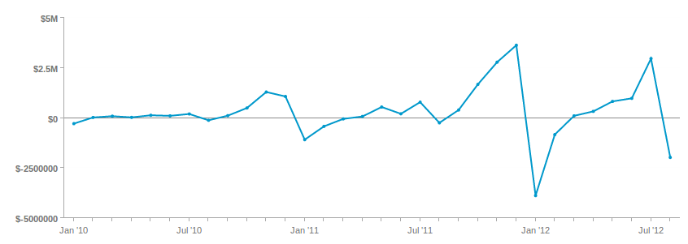
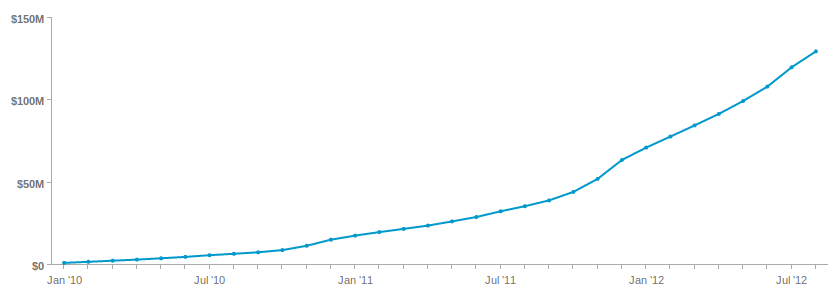
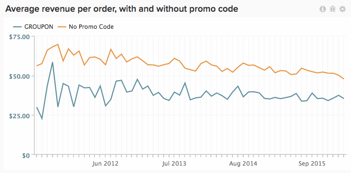

The [Visual Report Builder](../data-user/reports/ess-rpt-build-visual.md) allows you to visually explore your data to draw insights and help drive business decisions. This tutorial walks you through the process of creating a basic report.

>[!NOTE]
>
>To add a report to a dashboard, you need **Standard** [user permissions](../administrator/user-management/user-management.md) and Edit access to the dashboard.

## Step 1: Creating a Report

To get started creating a new report, click **Report Builder** on the sidebar or the **Add Report** button at the top of any dashboard. When the **Report Builder** selection page displays, click the **Visual Report Builder** option.

To edit a report created in the Visual Report Builder, click the gear (Options) icon in the top right corner of any chart, then click **Edit**.

## Step 2: Adding Metrics

The first step in creating an analysis is selecting [the metric](../data-user/reports/ess-manage-data-metrics.md) to analyze. While the metrics are listed alphabetically by default, you can also group them by the table that powers the metric.

You can add additional metrics after the initial metric is selected and overlay all the metrics on a single report or perform multi-metric calculations by adding formulas.

## Step 3: Adding Formulas

Formulas are added to reports by clicking the **Add Formula** button, located just above the list of metrics in the report. In the [formula editor](../data-analyst/dev-reports/formulas-in-rpt-bldr.md), any of the metrics included in the report can be used as inputs. Basic mathematical operators are used to manipulate the different metrics.

Let's say we wanted to create a report that shows us the average revenue per order. In this case, we would divide the **Revenue** metric by the **Number of orders** metric.

## Step 4: Setting the Time Period and Interval of Analysis {#time}

To zero in on a particular stretch of time, you can set the time period for the analysis. You can also choose time intervals to segment the data; for example, by year, quarter, month, etc. Use the menus in the top right corner of the chart to set the time period and interval.

When setting a specific date range for the time period, make sure the start date is at the beginning of the interval and the end date is at the end of your interval.

For example, setting a time period from January 1st to March 1st and choosing a monthly interval will show March as a datapoint, but ignore every day in March except March 1st. In that case, you should make your Time Period from January 1st to March 31st.

## Step 5: Group by / Segmenting the Analysis {#groupby}

[To segment your metrics by a data dimension](../best-practices/segment-filter.md), click the **Group by** menu at the top left of the chart. This will reveal a dropdown including all available dimensions of the first metric included in the list.

You can choose **None** to prevent a metric from being segmented. For example, you might want a metric that returns total revenue without being segmented, while having another revenue metric segmented by region.

Go back to our average revenue per order example and set the Group by to promo code. This will show us the average revenue per order for orders both with and without a promo code.

If the metrics included in the analysis are built on different data tables, a pop-up will allow you to select the matching data dimension in each table. The goal here is to find dimensions that share the same type of values for segmentation:

## Step 6: Setting Metric Filters, Perspective, and Time Interval {#metric-specific}

For each metric added to the analysis, you can add filters, select the relevant data perspective, and set time interval options. To access these features, click the **funnel** (Filter), **eye** (Perspective), and **clock** (Time) icons located next to the metrics included in the report.

### Filters

Filters limit the dataset included in the analysis. Filters are extremely useful, for example, when evaluating individual acquisition channels and removing outliers.

In addition to the dropdown menus and text box, you can also use special filter operators such as LIKE or IN to create filters.

The use of wildcards (`%` or `_`) in conjunction with LIKE statements is supported. The `%` wildcard will match multiple characters, while `_` will only match any single character. For example:

- `affiliate's name Like B%` will only allow data from customers whose name starts with `B`.

- `affiliate's name Like _ake` will only allow data from customers whose names are something like `Jake`, `Rake`, or `Bake` but not `Drake` or `Blake`.

Adding multiple filters allows tight control of the chart's data. By default, all filter conditions must be true for a piece of data to be included, but you can create OR relationships by editing the Filter Rules text box.

### Perspectives

Perspectives allow you to easily toggle between different views of your data. Let's take a look at what's available:

- **Standard perspective**: The standard perspective shows you the result for the matching date on the x-axis (e.g. revenue in January). This is the perspective we're using in our Average revenue per orders example.

- **Amount OR Percent Change vs Previous Period perspective**: This perspective shows the amount or percent change from one interval to the next and is useful for measuring the rate of change in fast-changing metrics.There is also a perspective to compare the interval to the same time period last year to show year over year growth.

- **Cumulative perspective**: The cumulative perspective shows the ongoing or cumulative sum amount of the metric over the time period. This is often used to analyze total customers and plan for future capacity.

- **Percent of First Value perspective**: This perspective shows the data as a percentage of the first time interval included in the analysis. This is helpful in measuring the effectiveness of specific actions relative to the first period performance.

- **Rolling averages window perspective**: The rolling averages window perspective shows the rolling average value of a metric over the specified time range. The interval must be the same as the interval set on the report level. For example, if the report is showing the last full quarter of Revenue by week, you can set the rolling average window time range to 4 weeks, and the first three values will be null and the fourth value represents the average of the first 4 weeks of Revenue. For clarity, make sure to turn off the **Multiple Y-Axes** checkbox if you are viewing the same metric with a rolling average, like in the example below.

### Metric-specific Time Options

Two options exist for metrics used in reports: they can trend over time according to the global time options, or not, which will display them as a scalar number.

Changing a metric time interval to **None** returns a scalar number, which is useful when creating formulas that involve dividing a time-trending metric by a scalar number. Additionally, you can also change the time range of the scalar metric to a time range independent of that for the report.

Let's say, for example, we wanted to see 2019 **monthly** revenue expressed as a percentage of **overall** 2019 revenue. We can add two **Revenue** metrics to a report with a global time range of January 1st 2019 to December 31 2019, segmented by monthly interval.

Note that if you add group-by dimensions, choose a new visualization, or adjust the time interval and then save just the Number (scalar), those adjustments will not be kept the next time you open that report from a dashboard - only the time range will be kept.

To learn more about using time options in your reports, see this [tutorial](../tutorials/time-options-visual-rpt-bldr.md).

## Step 7: Saving the Report

When you create a new chart, you can save it by clicking the **Save** button at the top right corner of the Visual Report Builder.

You can choose to save a chart, table, or number (scalar) using the **Type** dropdown and the dashboard to which the report should be saved using the Location dropdown.

You can then save the report by clicking the **Save to Dashboard** button.

## Report Outputs

To help you decide which report output to choose, see the following:

### Chart

### Table

### Number (scalar)

## Congratulations! You are finished.
